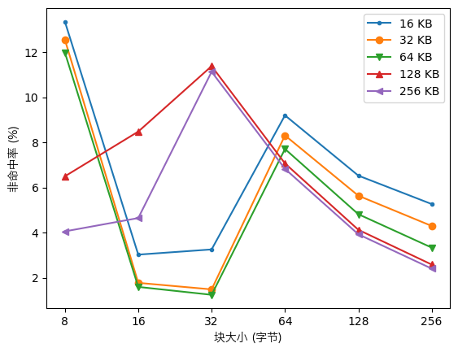
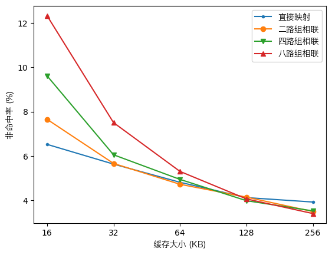

# 实验4：构建cache模拟器

20300246005 黄宇悦

## 模拟器设计
### 运行项目
首先运行`make`编译出`cachesim`程序
```
$ make clean && make
```
运行`cachesim`与任务制定的需求一样，即:
```
$ cachesim -c cfg.txt -t ls.trace [-o ls.trace.out]
```
其中:
```
-c 后面的参数指定配置文件，配置文件的格式见2.2;
-t 后面的参数指定跟踪文件，跟踪文件的格式见2.3;
-o 后面的参数指定输出文件，输入文件的格式见2.4;该参数是可选的([]意味着该参数可以不写)，此时直接输出 到标准输出。
```
若要获得缓存在不同设置下的性能分析， 则:
```
# 只能在 Unix / Unix 类系统才能运行`driver.py`
$ python driver.py
```
获得`results.csv`，再利用`analyse.ipynb`获得分析图像

### 源代码目录
```sh
cache-c/
├─ cache.h      // 缓存头目录
├─ cache.c      // 缓存实现
├─ cachesim.c   // 模拟器实现
├─ driver.py    // 测试不同缓存设置有效应的脚本
├─ Makefile     // Makefile
├─ result.csv   // 获得的结果
```

### 数据接口
#### 缓存的数据接口:
```c
#define CACHE_HIT 1
#define CACHE_MISS 2
#define CACHE_EVICT 4
...
struct cache
{
    struct cache_cfg cfg;
    struct cache_set *sets;
    struct cache_addr cache_addr;
    mem_addr_t mem_addr;
    uint32_t num_sets;
    uint32_t num_lines;
    uint8_t flags;
    uint64_t cycles;
};
...
void init_cache(char *cfg, struct cache *cache);
void access_cache(mem_addr_t mem_addr, struct cache *cache);
```
#### 缓存函数调用
- 利用`init_cache`来根据`cfg`文件制定缓存设置
- 利用`access_cache`来访问缓存，若要获得访问状态，可利用:
    - `cache.flags | CACHE_HIT` 获得是否访问命中
    - `cache.flags | CACHE_MISS` 获得是否访问非命中
    - `cache.flags | CACHE_EVICT` 获得是否缓存是否替换

### 典型输入与输出
输入
```sh
$ cachesim -c cfg.txt -t ls.trace
```
得出的`ls.trace.out`文件内容:
```
Total Hit Rate: 86.65
Load Hit Rate: 86.36
Store Hit Rate: 87.32
Total Run Time: 3503276
Average MA Latency: 14.353218
```

## 实验结果
- 缓存块大小选择32、64、128、256字节，缓存大小选择16KB、32KB、64KB、128KB或256kb，直接映射、写分配、LRU替换规则;


- 缓存块大小为128字节，缓存大小选择16KB、32KB、64KB、128KB或256kb，关联性选择直接映像、2路组相 联、4路组相联、8路组相联，写分配、LRU替换规则;


## 实验结论
通过此次实验，深刻了解了缓存的基本运作原理，同时理解了各种对于缓存性能有所影响的原因。

